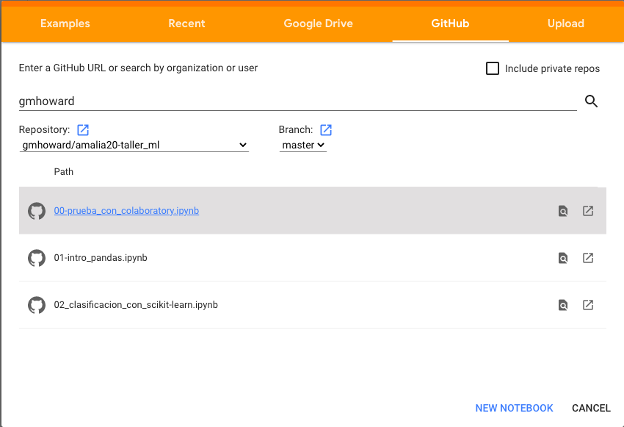

# Taller: Introducción a Ciencia de Datos y Machine Learning con Python

Interesada/o en aprender sobre machine learning (ML) pero no sabes por dónde empezar? 
Confundida/o sobre si ML y data science significan lo mismo? Tienes un dataset que deseas analizar? 
En este taller veremos los conceptos basicos de ML, aprenderemos a explorar y preparar datasets y 
utilizaremos algoritmos de ML para construir modelos que nos permitirán extraer información, 
utilizando el popular lenguaje de programación Python.

En el taller utilizaremos la versión 3.x de Python, junto a tres de las principales librerías en 
Python para realizar tareas de machine learning:
- [pandas](https://pandas.pydata.org/) para la manipulación y análisis de datos,
- [scikit-learn](https://scikit-learn.org/stable/) para el análisis predictivo de los datos, y
- [matplotlib](https://matplotlib.org/) para crear gráficas y visualizaciones estáticas y dinámicas 
de los datos.

Para participar en el taller sólo se necesita:
- una computadora con acceso al Internet
- un navegador web como Google Chrome (preferible) o Mozilla Firefox
- una cuenta de Google. Si usas GMail, ya posees una cuenta. Si no tienes una, sigue las siguientes instrucciones: [Cómo crear una Cuenta de Google](https://support.google.com/accounts/answer/27441?hl=es-419). 

No es necesario instalar software adicional ya que todos los ejercicios se realizarán por medio del navegador web.

__Preparación para el Taller__

Utilizaremos *Google Colaboratory (Colab)* para trabajar todos los laboratorios del taller. Colab es 
un servicio de Google Cloud que te permite escribir y ejecutar código Python desde tu navegador web, 
lo que reduce significamente la necesidad de instalar o configurar, ofrece el acceso a procesadores 
especializados para ML y permite fácilmente compartir tus archivos.

Esta opción elimina la necesidad de instalar software, ya que sólo requiere acceso al Internet para 
interactuar (ejecutar y editar) el código de las laboratorios.

Realiza los siguientes pasos antes del día del taller para confirmar que la computadora que utilizarás, 
está lista para los ejercicios que haremos ese día:

- Visita el sitio [Google Colab](https://colab.research.google.com). Al hacerlo, aparecerá la
pantalla para seleccionar el archivo a utilizar. Selecciona la opcion `GitHub` (sobre fondo naranja).

- En donde dice `Enter GitHub URL or search by organization or user`, escribe `gmhoward` y aprieta 
`<enter>`. Te conectarás con el repositorio GitHub, en donde están ubicados todos los archivos a 
utilizar.

- Luego de unos segundos, aparecerá la lista de repositorios (bajo `Repository`). Selecciona la opción 
`gmhoward/amalia20-taller-ml` para listar los archivos del taller.

- Haz doble click sobre el archivo `00-prueba_con_colaboratory.iynb` para abrirlo en Colab.

El archivo continue instrucciones de como utilizar Google Colab y que te ayudarán durante el taller.
Por esta razón, dedícale unos minutos para leerlo antes del taller. Por ejemplo, es necesario 
familiarizarte con el procedimiento para ejecutar código  (apretando simultáneamente 
`Control/Command + Enter`)

El archivo (también llamado `notebook`) contiene enlaces a otras fuentes de información, que 
puedes explorar antes o después del taller.

Eso es todo! Estás lista/o para el taller de `Machine Learning con Python`.

En caso de necesitar ayudar, no te preocupes. Puedes consultar con cualquiera de los instructores, el 
día del taller.
